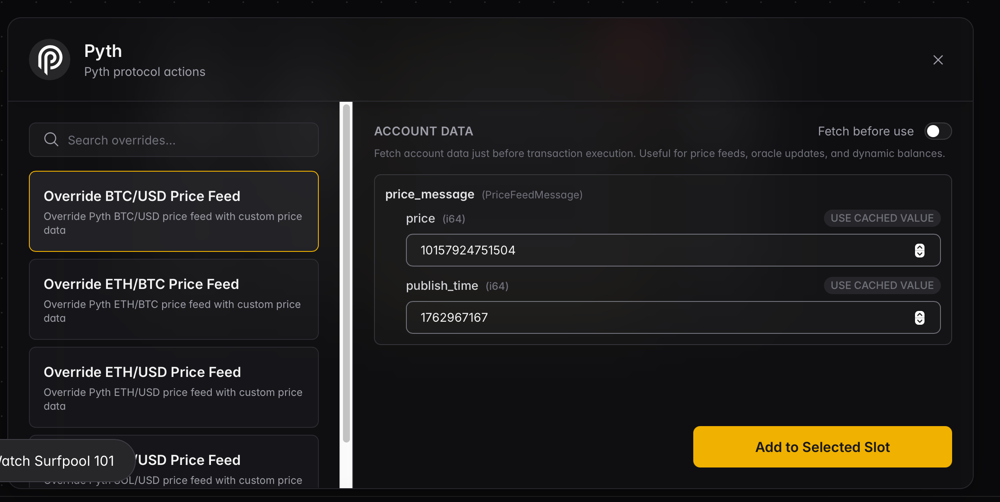

# Surfpool Scenarios
This module contains pre-defined scenarios that can be executed within the Surfpool environment. 
These scenarios allow you to create a time-sequence of account states.
As the scenario is executed, each step, which is associated with a subsequent slot in the surfnet, will override the surfnet accounts db with the account states defined in that step.
This powerful tool allows for testing and simulation of various account states over time, enabling developers to observe how different scenarios will impact their protocol.

## Scenario Components
There are a few components that allow a scenario to function.

### Program IDL
For Surfpool to understand how to serialize and deserialize account data, it needs to have access to the program's IDL. 
Protocols that are natively supported by Surfpool will have their IDLs included by default.

**Currently supported protocols:**
- **Pyth v2** - Price oracle with 4 price feed templates (SOL/USD, BTC/USD, ETH/BTC, ETH/USD)
- **Jupiter v6** - DEX aggregator with TokenLedger manipulation template
- **Switchboard On-Demand** - On-demand oracle with QuoteAccount override template
- **Kamino v1.x** – Lending protocol with Reserve liquidity, risk config, and Obligation health override templates
- **Drift v2** - Perp and spot markets, user state, and global state

For custom protocols, an IDL can be registered at runtime using the [`surfnet_registerIdl`](https://docs.surfpool.run/rpc/cheatcodes#surfnet-registeridl) RPC cheatcode.

### Scenario Registration
Scenarios can be registered at runtime using the [`surfnet_registerScenario`](https://docs.surfpool.run/rpc/cheatcodes#surfnet-registerscenario) RPC cheatcode. 
This cheatcode takes in a scenario definition in JSON format, which includes the scenario name, description, and a list of overrides to apply to accounts.
Each override contains a map of the field in the account to override (as indexed in the IDL), and the value to apply for that key.

### Override Templates
Directly using the `surfnet_registerScenario` endpoint requires building out a map of account keys that are specific to the schema of the account that is being written to.
This is a cumbersome process in most cases.
Override templates that are registered in the Surfpool repo will automatically be available in Surfpool Studio's drag-and-drop UI for creating scenarios.
This UI will automatically create the `surfnet_registerScenario` payload for you, eliminating the complexity from the process.

## Creating Native Scenario Support for a Protocol
Having a protocol being natively supported by Surfpool Scenarios will allow users to easily create scenarios to override account states for that protocol.
All accounts in a surfnet's account db that are owned by the protocol will include automatic IDL-parsing, and the protocol's account overrides will be available in Surfpool Studio's drag-and-drop UI.

The following steps can be followed to natively support a protocol:
 1. Create a folder for the protocol in the `crates/core/src/scenarios/protocols` folder. For example, `crates/core/src/scenarios/protocols/pyth/v2`.
 2. Add a file called `idl.json` containing the protocol's anchor IDL to the folder. For example, see [Pyth's IDL](./protocols/pyth/v2/idl.json) or [Jupiter's IDL](./protocols/jupiter/v6/idl.json)
 3. Add a file called `overrides.yaml` to the folder. For example, see [Pyth's Override File](./protocols/pyth/v2/overrides.yaml) or [Jupiter's Override File](./protocols/jupiter/v6/overrides.yaml).
    1. This file is what will populate Surfpool Studio's UI with the protocol details. The Pyth override file linked above produces the following in the UI:
   
 4. Update the [registry.rs](./registry.rs) file. A small amount of code has to be written to wire together the template registry, the `overrides.yaml`, and the `idl.json`. See the `load_pyth_overrides` and `load_jupiter_overrides` functions for examples.

If any part of these instructions are beyond your skill level or availability, but you'd like to see a specific protocol supported, feel free to [Open an Issue to Support a new Protocol](https://github.com/txtx/surfpool/issues/new?template=native-scenario-support-for-protocol.md)!
Opening an issue to signal interest is a big help.
If you're able to find an IDL for the protocol, even better!
